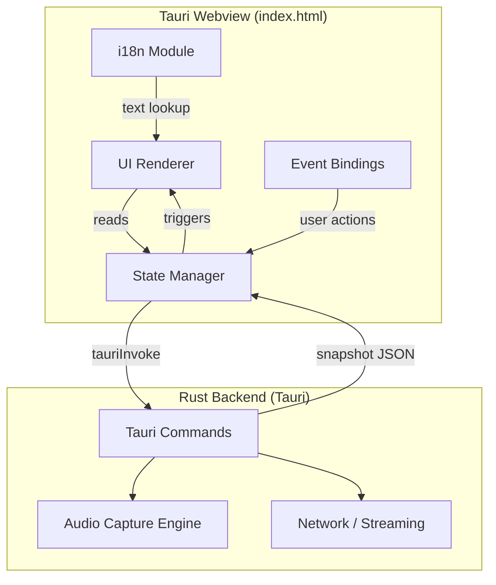
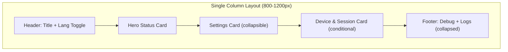
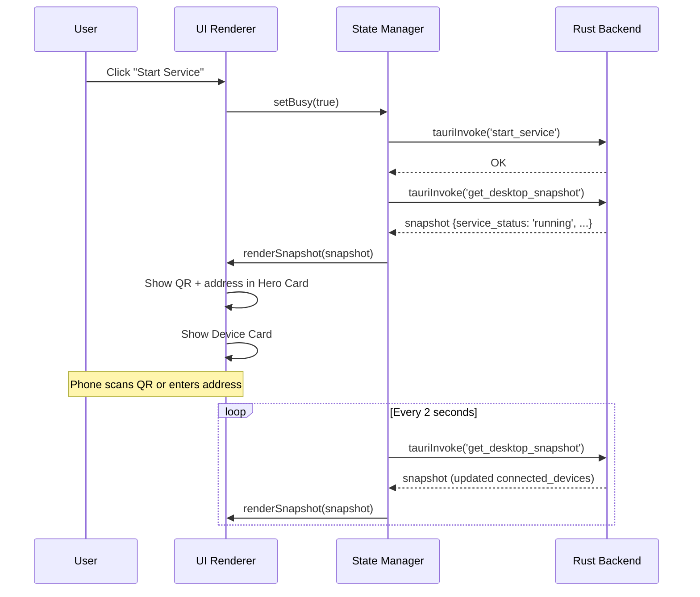
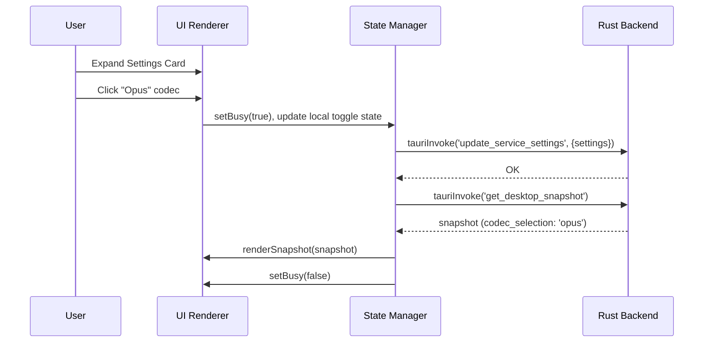

# Design Document: Desktop UI Redesign

## Overview

The LAN Audio desktop client UI is a single-page web application rendered inside a Tauri webview (`apps/desktop/web/index.html`). The current layout suffers from information overload — technical details (data plane, codec, protocol path, gray mode) compete for attention with the primary user actions (start/stop service, connect a phone). The redesign introduces a clear visual hierarchy with a dominant Hero Status Card, progressive disclosure of settings, and contextual visibility of device/session information.

The new layout follows a single-column, card-based architecture: Header → Hero Status Card → Settings Card (collapsed) → Device & Session Card (conditional) → Footer (debug/logs collapsed). This mirrors the mental model of "start service → connect phone → optionally tweak settings" and keeps the Audio Console Dark design language consistent with the Android client.

All existing Tauri command calls, i18n keys, and the 2-second polling refresh cycle are preserved. No new dependencies are introduced — the implementation remains a single HTML file with inline CSS and JS.

## Architecture



### Component Layout Architecture



## Sequence Diagrams

### Main Flow: Start Service → Connect Device



### Settings Change Flow



## Components and Interfaces

### Component 1: Header

**Purpose**: App identity and language switching. Minimal, stays out of the way.

**Interface**:
```javascript
// No state dependency — purely static with lang toggle
function renderHeader(lang) // Updates title, subtitle text
```

**Responsibilities**:
- Display app title and subtitle (i18n)
- Language toggle (zh/en) with immediate re-render
- Update banner (new version available) — shown inline below title

---

### Component 2: Hero Status Card

**Purpose**: The primary interaction surface. Shows service state, start/stop action, and connection info when running.

**Interface**:
```javascript
function renderHeroCard(snapshot, busy) {
  // Returns: updates to status dot, headline, subline,
  //          primary action button, connection panel, health strip
}
```

**Responsibilities**:
- Status indicator (dot + headline + subline)
- Primary action button (Start/Stop) — largest interactive element
- Connection panel (address + copy + QR code) — visible only when running
- Health strip (streaming status, device count, audio source)
- Error text + firewall guidance (conditional)

**Layout**:
```
┌─────────────────────────────────────────────────────┐
│  ● Running · 1 device connected (192.168.1.5)       │
│  Service is online. Discover and connect from phone. │
│                                                     │
│  [ ■ Stop Streaming ]                               │
│                                                     │
│  ┌─────────┐  Connect: 192.168.1.100:39991 [Copy]  │
│  │  QR     │  Scan from Android to connect.         │
│  │  Code   │  lan-audio://192.168.1.100:39991       │
│  └─────────┘                                        │
│                                                     │
│  Streaming: Healthy │ Devices: 1 │ Source: System   │
└─────────────────────────────────────────────────────┘
```

---

### Component 3: Settings Card

**Purpose**: Progressive disclosure of technical configuration. Collapsed by default to reduce cognitive load.

**Interface**:
```javascript
function renderSettingsCard(snapshot, busy) {
  // Updates toggle states, button active classes, disabled states
}
```

**Responsibilities**:
- Audio source picker (System Audio / Test Tone)
- Codec picker (PCM16 / Opus)
- Data plane picker (Legacy LAS1 / V2 Header)
- Fallback toggle
- Safe mode button
- Dump toggle (debug)
- All controls disabled when busy

---

### Component 4: Device & Session Card

**Purpose**: Show connected device information. Only visible when service is running.

**Interface**:
```javascript
function renderDeviceCard(snapshot, adbDevices, busy) {
  // Conditionally shows/hides entire card
  // Renders device list, session info, USB panel
}
```

**Responsibilities**:
- Current device info (count, mode, RTT)
- Recent devices list
- Session details (address, protocol, version, mode)
- USB panel (only when transport_mode === 'usb')

---

### Component 5: Footer (Debug & Logs)

**Purpose**: Collapsible debug metrics and runtime logs for troubleshooting.

**Interface**:
```javascript
function renderFooter(snapshot) {
  // Updates debug metrics and log pane content
}
```

**Responsibilities**:
- Debug metrics (3-column grid: Sending, Capture, State)
- Runtime logs (monospace, scrollable)
- Both collapsed by default via `<details>` elements

## Data Models

### Snapshot (from Rust backend)

```javascript
/**
 * @typedef {Object} DesktopSnapshot
 * @property {string} service_status - 'not_started'|'starting'|'running'|'stopping'|'error'
 * @property {string} audio_source - 'windows_loopback'|'synthetic'
 * @property {string} data_plane_format - 'legacy_las1'|'v2_header'
 * @property {string} codec_selection - 'pcm16'|'opus'
 * @property {string} effective_codec - 'pcm16'|'opus'
 * @property {string} connect_address - e.g. '192.168.1.100:39991'
 * @property {string} local_ip - e.g. '192.168.1.100'
 * @property {number} ws_port - WebSocket port
 * @property {number} udp_port - UDP data port
 * @property {number} connected_devices - count of active connections
 * @property {string[]} recent_clients - list of recent client descriptions
 * @property {string} session_status - session state string
 * @property {string} transport_mode - 'wifi'|'usb'
 * @property {string|null} usb_serial - USB device serial if connected
 * @property {boolean} fallback_to_synthetic
 * @property {boolean} capture_dump_wav
 * @property {string} error_message
 * @property {string} version
 * @property {number} protocol_version
 * @property {string} recommended_connection
 * @property {Object} service_snapshot - runtime state from audio engine
 * @property {Object} metrics - capture metrics
 * @property {string[]} logs - recent log lines
 * @property {Object|null} update_banner - {latest_version, release_url}
 * @property {Object} mode_profile - {start_buffer_ms, max_buffer_ms, batch_frames}
 * @property {Object} capabilities - feature flags
 */
```

### UI State

```javascript
/**
 * @typedef {Object} UIState
 * @property {'zh'|'en'} lang - Current language
 * @property {DesktopSnapshot|null} snapshot - Latest backend snapshot
 * @property {boolean} busy - Whether a command is in-flight
 * @property {AdbDevice[]} adbDevices - Detected ADB devices
 * @property {number} lastAdbRefreshAt - Timestamp of last ADB refresh
 * @property {string} qrKey - Cache key for QR SVG (avoids re-render)
 * @property {boolean} settingsExpanded - Whether settings card is open
 */
```

**Validation Rules**:
- `lang` must be 'zh' or 'en'
- `snapshot` may be null before first poll completes
- `busy` prevents all user interactions when true
- `qrKey` used to avoid re-rendering QR SVG on every poll cycle

## Key Functions with Formal Specifications

### Function: renderHeroCard()

```javascript
function renderHeroCard(snapshot, busy)
```

**Preconditions:**
- `snapshot` is a valid DesktopSnapshot object or null
- `busy` is a boolean

**Postconditions:**
- Status dot class reflects service_status ('running'→green, 'error'→red, 'starting'/'stopping'→amber)
- Headline text contains localized state + device info
- Primary button shows 'Start' when stopped/error, 'Stop' when running, disabled when busy
- Connection panel (QR + address) visible if and only if service_status === 'running'
- Health strip shows streaming health, device count, source name
- Error text shown if snapshot.error_message is non-empty

**Loop Invariants:** N/A

---

### Function: toggleCardVisibility()

```javascript
function toggleCardVisibility(cardId, visible)
```

**Preconditions:**
- `cardId` is a valid DOM element ID
- `visible` is a boolean

**Postconditions:**
- Element with `cardId` has `display: none` if visible === false
- Element with `cardId` has `display: block` (or appropriate) if visible === true
- No other elements are affected

---

### Function: applySettings()

```javascript
async function applySettings(nextAudioSource = null)
```

**Preconditions:**
- `state.snapshot` is not null
- UI is not in busy state (caller responsibility)

**Postconditions:**
- Tauri command 'update_service_settings' invoked with current UI toggle states
- On success: snapshot refreshed and UI re-rendered
- On failure: error text displayed, busy state cleared
- No partial state: either all settings applied or none

---

### Function: getMainAction()

```javascript
function getMainAction(snapshot)
```

**Preconditions:**
- `snapshot` is a valid DesktopSnapshot or null

**Postconditions:**
- Returns `{action: 'start', label, stop: false}` when service_status is 'not_started' or 'error'
- Returns `{action: 'stop', label, stop: true}` when service_status is 'running'
- Returns `{action: null, label: 'Processing...', stop: false}` when busy or transitioning
- Return value is deterministic for same inputs

## Algorithmic Pseudocode

### Main Render Cycle

```javascript
// ALGORITHM: renderSnapshot
// INPUT: snapshot (DesktopSnapshot from Tauri backend)
// OUTPUT: DOM mutations reflecting current state

function renderSnapshot(snapshot) {
  // ASSERT: snapshot is valid object with required fields
  state.snapshot = snapshot;

  // Phase 1: Compute derived state
  const runtime = snapshot.service_snapshot || {};
  const isRunning = snapshot.service_status === 'running';
  const isError = snapshot.service_status === 'error';
  const isBusy = state.busy || snapshot.service_status === 'starting' 
                             || snapshot.service_status === 'stopping';
  const isSafeMode = runtime.rollback_state === 'forced_legacy_las1_pcm16';

  // Phase 2: Render Hero Card
  renderStatusDot(snapshot.service_status);
  renderHeadline(snapshot);
  renderSubline(snapshot);
  renderPrimaryAction(snapshot, isBusy);
  renderConnectionPanel(isRunning, snapshot);
  renderHealthStrip(snapshot, runtime);
  renderErrorState(snapshot, runtime);

  // Phase 3: Render Settings Card (always present, toggle states only)
  renderSettingsToggles(snapshot, isSafeMode, isBusy);

  // Phase 4: Conditionally render Device Card
  toggleCardVisibility('deviceCard', isRunning);
  if (isRunning) {
    renderDeviceInfo(snapshot, runtime);
    renderRecentDevices(snapshot);
    renderUsbPanel(snapshot);
  }

  // Phase 5: Render Footer (debug + logs)
  renderDebugMetrics(snapshot, runtime);
  renderLogs(snapshot.logs);

  // Phase 6: Disable all controls if busy
  setControlsDisabled(isBusy);
}
// POSTCONDITION: DOM reflects snapshot state
// POSTCONDITION: No stale data from previous render visible
```

### Visibility Decision Algorithm

```javascript
// ALGORITHM: determineCardVisibility
// INPUT: snapshot, settingsExpanded (boolean)
// OUTPUT: visibility map for each card section

function determineCardVisibility(snapshot) {
  const isRunning = snapshot?.service_status === 'running';
  const hasUsb = snapshot?.transport_mode === 'usb';

  return {
    heroCard: true,                    // Always visible
    connectionPanel: isRunning,        // Only when streaming
    settingsCard: true,                // Always present (collapsible)
    deviceCard: isRunning,             // Only when service active
    usbSection: isRunning && hasUsb,   // Only when USB mode active
    debugSection: true,                // Always present (collapsed)
    logSection: true,                  // Always present (collapsed)
  };
}
// POSTCONDITION: Each key maps to boolean
// POSTCONDITION: connectionPanel === true implies heroCard === true
// POSTCONDITION: usbSection === true implies deviceCard === true
```

### Safe Mode Toggle Algorithm

```javascript
// ALGORITHM: toggleSafeMode
// INPUT: current snapshot state
// OUTPUT: Tauri command invoked, UI refreshed

async function toggleSafeMode() {
  // PRECONDITION: state.snapshot is not null
  if (!state.snapshot) return;

  const isSafeMode = state.snapshot.data_plane_format === 'legacy_las1' 
                  && state.snapshot.codec_selection === 'pcm16';

  if (isSafeMode) {
    // Currently in safe mode → restore recommended path
    await call('restore_recommended_mode');
  } else {
    // Currently on recommended path → confirm before rollback
    if (window.confirm(t('rollbackConfirm'))) {
      await call('switch_to_rollback_mode');
    }
  }
  // POSTCONDITION: If confirmed, backend state toggled
  // POSTCONDITION: UI refreshed via call() → refresh()
}
```

## Example Usage

```javascript
// Example 1: Initial page load
async function init() {
  document.getElementById('langSelect').value = state.lang;
  renderText();       // Apply i18n to all static labels
  bindEvents();       // Wire up click/change handlers
  await refresh();    // First snapshot fetch + render
  setInterval(refresh, 2000);  // Start polling
}

// Example 2: User clicks Start
document.getElementById('primaryActionBtn').addEventListener('click', async () => {
  const action = document.getElementById('primaryActionBtn').dataset.action;
  if (action === 'start') await call('start_service');
  if (action === 'stop') await call('stop_service');
});

// Example 3: Settings card expand/collapse
document.getElementById('settingsToggle').addEventListener('click', () => {
  const card = document.getElementById('settingsContent');
  const isOpen = card.style.display !== 'none';
  card.style.display = isOpen ? 'none' : 'block';
  state.settingsExpanded = !isOpen;
});

// Example 4: Copy address to clipboard
async function copyAddress() {
  if (!state.snapshot) return;
  await navigator.clipboard.writeText(state.snapshot.connect_address);
  showToast(t('copied'));
}
```

## Correctness Properties

1. **∀ snapshot: service_status ≠ 'running' ⟹ connectionPanel.display === 'none'**
   The QR code and connection address are never shown when the service is not running.

2. **∀ snapshot: busy === true ⟹ all interactive controls are disabled**
   No user action can fire while a Tauri command is in-flight.

3. **∀ snapshot: transport_mode ≠ 'usb' ⟹ usbSection.display === 'none'**
   USB panel is hidden unless USB mode is actively in use.

4. **∀ render cycle: DOM state is fully determined by (snapshot, state.lang, state.busy)**
   No render produces different output for the same inputs (deterministic rendering).

5. **∀ settings change: call() sets busy=true before invoke, busy=false after refresh**
   The busy flag brackets every async operation, preventing race conditions.

6. **∀ language change: all visible text updates immediately without page reload**
   Language toggle triggers full re-render of text and snapshot.

7. **∀ snapshot with error_message: errorText is visible AND firewallGuidance is evaluated**
   Errors are never silently swallowed.

8. **Settings card collapsed by default: on page load, settingsContent.display === 'none'**
   Users see the simplified main view first.

## Error Handling

### Error Scenario 1: Tauri Bridge Unavailable

**Condition**: `window.__TAURI__` is undefined (e.g., opened in regular browser)
**Response**: `tauriInvoke()` throws, caught by `refresh()`, displayed in error text
**Recovery**: User must open the app via Tauri; no graceful degradation needed

### Error Scenario 2: Service Start Failure

**Condition**: `start_service` command fails (port in use, capture device unavailable)
**Response**: Snapshot returns with `service_status: 'error'` and `error_message` populated
**Recovery**: Hero card shows error state, firewall guidance panel evaluates message, user can retry

### Error Scenario 3: Clipboard API Unavailable

**Condition**: `navigator.clipboard.writeText()` rejects (non-HTTPS context in some browsers)
**Response**: Fallback displays address in status subline for manual copy
**Recovery**: Automatic — user sees the address text

### Error Scenario 4: QR SVG Generation Failure

**Condition**: `get_connection_qr_svg` Tauri command fails
**Response**: QR container shows error text instead of SVG
**Recovery**: Address is still displayed as text; QR is supplementary

### Error Scenario 5: ADB Device Refresh Failure

**Condition**: `list_adb_devices` command fails (adb not installed)
**Response**: `adbDevices` set to empty array, USB panel shows "No devices detected"
**Recovery**: Graceful — Wi-Fi mode continues to work; USB section hidden if not in USB mode

## Testing Strategy

### Unit Testing Approach

Since this is a single HTML file with inline JS, testing focuses on:
- **Pure function tests**: `getMainAction()`, `buildHeadline()`, `buildSubline()`, `determineCardVisibility()`, `firewallGuidanceForMessage()` can be extracted and tested with mock snapshots
- **Render assertions**: Given a snapshot, verify DOM state matches expected visibility/content
- **i18n completeness**: Verify all keys exist in both `zh` and `en` dictionaries

### Property-Based Testing Approach

**Property Test Library**: fast-check (if extracted to testable module)

Key properties to test:
- For any valid snapshot, `renderSnapshot()` never throws
- For any service_status value, exactly one visual state is shown (running/error/stopped/busy)
- For any combination of (data_plane, codec), safe mode detection is correct
- Connection panel visibility is strictly tied to service_status === 'running'

### Integration Testing Approach

- **Tauri integration**: Mock `tauriInvoke` to return various snapshot states, verify full render cycle
- **Polling stability**: Verify 2-second interval doesn't accumulate errors or memory leaks
- **Responsive layout**: Visual regression at 800px, 1000px, 1200px widths

## Performance Considerations

- **QR caching**: QR SVG only re-rendered when connection URI changes (tracked via `state.qrKey`)
- **Minimal DOM mutations**: Only update elements whose values changed (compare before write)
- **No framework overhead**: Vanilla JS with direct DOM manipulation — no virtual DOM diffing
- **Polling efficiency**: Single `get_desktop_snapshot` call returns all data; no waterfall requests
- **ADB throttling**: ADB device list refreshed at most every 15 seconds unless forced

## Security Considerations

- **No external resources**: All CSS/JS inline; no CDN dependencies; no network requests from UI
- **Tauri command boundary**: All privileged operations go through Tauri invoke; webview has no direct system access
- **Clipboard**: Uses standard `navigator.clipboard` API; no fallback that could expose data
- **No user input sanitization needed**: All displayed data comes from trusted Rust backend
- **CSP compatible**: No inline event handlers in HTML; all events bound via `addEventListener`

## Dependencies

- **Tauri 2.x**: Provides webview container and `invoke` bridge to Rust backend
- **No npm packages**: Zero JavaScript dependencies
- **No build tools**: Single HTML file served directly
- **Existing Tauri commands** (must remain unchanged):
  - `get_desktop_snapshot` — polling endpoint
  - `start_service` / `stop_service` — service lifecycle
  - `update_service_settings` — settings mutation
  - `switch_to_rollback_mode` / `restore_recommended_mode` — safe mode
  - `get_connection_qr_svg` — QR code generation
  - `list_adb_devices` / `enable_usb_mode` / `disable_usb_mode` — USB management
  - `export_support_bundle` — diagnostics export
  - `open_release_page` — update navigation

## CSS Architecture

### Layout Strategy

```css
/* Single-column card stack */
.app {
  max-width: 1040px;
  margin: 0 auto;
  display: flex;
  flex-direction: column;
  gap: 14px;
}

/* Cards share base styling */
.card {
  background: var(--panel);
  border: 1px solid var(--line-strong);
  border-radius: 8px;
  padding: 20px;
  box-shadow: 0 16px 42px rgba(0,0,0,0.22);
}

/* Hero card gets extra prominence */
.card--hero {
  padding: 24px;
}

/* Collapsible card header */
.card__header {
  display: flex;
  justify-content: space-between;
  align-items: center;
  cursor: pointer;
}

/* Connection panel within hero */
.connection-panel {
  display: grid;
  grid-template-columns: 120px 1fr;
  gap: 16px;
  align-items: center;
  margin-top: 16px;
  padding-top: 16px;
  border-top: 1px solid var(--line);
}
```

### Responsive Breakpoints

| Width | Behavior |
|-------|----------|
| ≥1040px | Max-width container, comfortable padding |
| 800–1039px | Full-width with side padding |
| <800px | Connection panel stacks vertically, health strip wraps |

### Design Tokens (unchanged from current)

| Token | Value | Usage |
|-------|-------|-------|
| `--bg` | #0c0f14 | Page background |
| `--panel` | #1e2433 | Card backgrounds |
| `--accent` | #00d4aa | Primary actions, active states |
| `--error` | #ef4444 | Error states, stop button |
| `--warn` | #f59e0b | Busy/transitioning states |
| `--text` | #f0f2f7 | Primary text |
| `--muted` | #8892a4 | Secondary text, labels |

## Migration Strategy

### What Changes

1. **Layout**: Two-column grid → single-column card stack
2. **QR placement**: Hidden until running → always in Hero card when running
3. **Settings**: Inline in left column → collapsible card (default collapsed)
4. **Device info**: Right column always visible → conditional card (only when running)
5. **USB panel**: Always visible → only shown when USB mode active
6. **Bottom sections**: 3 separate `<details>` → 2 `<details>` in footer area

### What Stays the Same

1. All Tauri command names and payloads
2. All i18n keys (may add a few new ones)
3. State management pattern (polling + render)
4. 2-second refresh interval
5. Design tokens / color palette
6. Font stack
7. Single HTML file architecture
