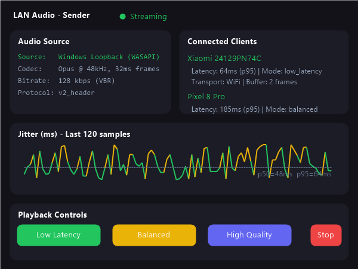
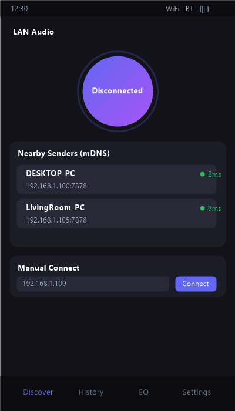
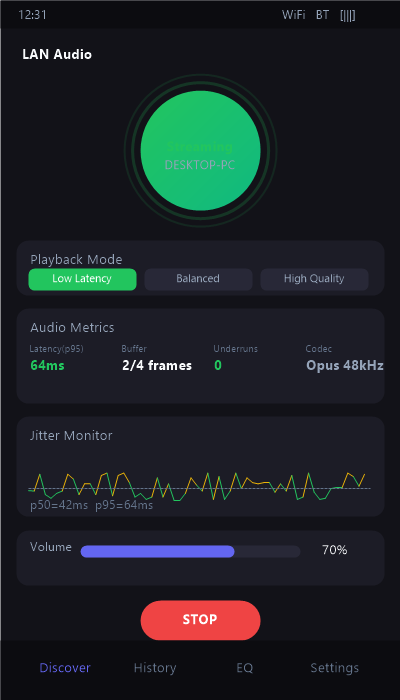
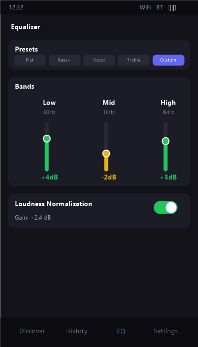
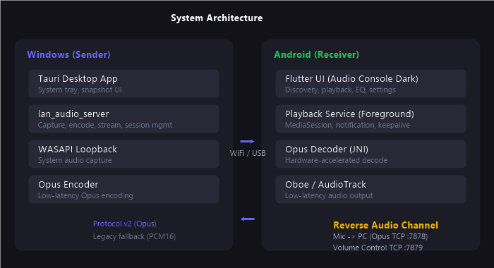

<p align="center">
  <h1 align="center">LAN Audio</h1>
  <p align="center">
    Turn your Windows PC into an audio sender and your Android phone into a network speaker — with low latency, over Wi-Fi or USB.
  </p>
</p>

<p align="center">
  <a href="https://github.com/MengBad/lan-audio/releases"></a>
  <a href="https://github.com/MengBad/lan-audio/blob/main/LICENSE"></a>
  <a href="https://codecov.io/gh/MengBad/lan-audio"></a>
  <a href="https://github.com/MengBad/lan-audio/stargazers"></a>
  
</p>

<p align="center">
  <a href="README.zh-CN.md">中文文档</a> &nbsp;|&nbsp;
  <a href="CHANGELOG.md">Changelog</a> &nbsp;|&nbsp;
  <a href="CONTRIBUTING.md">Contributing</a>
</p>

---

## What is LAN Audio?

LAN Audio streams real-time system audio from a Windows PC to one or more Android phones over your local network (Wi-Fi) or a USB cable. Your Android device becomes a low-latency network speaker.

It also supports a **reverse audio channel** (Android mic → PC) and **remote volume control** (PC → Android), making it a complete two-way audio bridge.

| Sender | Transport | Receiver |
| :---: | :---: | :---: |
| Windows PC (Rust + Tauri) | Wi-Fi / USB (adb reverse) | Android (Flutter + Oboe) |
| WASAPI Loopback capture | Protocol v2 + Opus | Hardware-accelerated Opus decode |
| Headless or desktop GUI | TCP with mDNS discovery | Audio Console Dark UI |

## Screenshots

<div align="center">
  <table>
    <tr>
      <td align="center"><b>Desktop Sender</b></td>
      <td align="center"><b>Android - Discovery</b></td>
    </tr>
    <tr>
      <td></td>
      <td></td>
    </tr>
    <tr>
      <td align="center"><b>Android - Playback</b></td>
      <td align="center"><b>Android - Equalizer</b></td>
    </tr>
    <tr>
      <td></td>
      <td></td>
    </tr>
  </table>
</div>

## Features

### Core Streaming
- **Real-time audio streaming** — Capture Windows system audio via WASAPI loopback and stream to Android over TCP
- **Dual transport** — Wi-Fi (LAN) for convenience, USB (adb reverse) for stability in congested networks
- **Three latency modes** — `low_latency` (~64ms p95), `balanced` (~185ms p95), `high_quality` (~505ms p95)
- **Opus codec** — Low-latency Opus encoding at 48kHz with VBR for efficient bandwidth usage
- **Multi-device streaming** — Stream to up to 4 Android devices simultaneously with independent sessions

### Discovery & Connectivity
- **mDNS service discovery** — Android auto-discovers nearby Windows senders, no manual IP entry required
- **Smart reconnect** — Exponential backoff (1s → 2s → 4s → 8s → 16s) after network interruptions
- **Connection history & favorites** — Frequently used devices persist for one-tap reconnect

### Audio Processing (Android)
- **3-band equalizer** — Low / Mid / High controls with presets (Flat, Bass Boost, Vocal, Treble) and persistent settings
- **Loudness normalization** — RMS-based software gain with live gain display and ramp smoothing
- **Oboe / AudioTrack** — Low-level Android audio output via Oboe (recommended) with AudioTrack fallback

### Reverse Channel & Control
- **Mic → PC reverse audio** — Android microphone streams to Windows via Opus-encoded TCP (port 7878) with named-pipe output
- **PC-side volume control** — Control Android volume from the Windows desktop tray, with on-phone volume pill indicator
- **Per-frame level metering** — Real-time audio level feedback on both forward and reverse paths

### Observability
- **Real-time jitter visualization** — Sparkline graph embedded in the Android UI with three-zone coloring and p50/p95 readout
- **Desktop diagnostics export** — Snapshot runtime state as JSON for troubleshooting
- **MediaSession integration** — Android foreground playback notification with MediaStyle controls and metadata

### Reliability
- **Permanent rollback path** — `legacy_las1 + pcm16` fallback is always available — never removed
- **Protocol v2** — Capability negotiation, mode synchronization, and parameter re-sync
- **Force-rollback verification** — CLI flag for headless rollback-path testing
- **Gray release switches** — Protocol paths are toggled via runtime configuration, not code deletion

## Quick Start

### Prerequisites

- **Windows 10+** with a working audio output
- **Android 8.0+** device
- **Rust 1.75+** (sender only)
- **Wi-Fi** on the same LAN, or a **USB cable** for adb mode

### Windows Sender

```powershell
# Clone the repository
git clone https://github.com/MengBad/lan-audio.git
cd lan-audio

# Start streaming with real system audio
cargo run -p lan_audio_server --bin desktop_headless -- --audio-source windows_loopback

# Or use a synthetic test tone for diagnostics
cargo run -p lan_audio_server --bin desktop_headless -- --audio-source synthetic

# USB mode (requires adb and device serial)
cargo run -p lan_audio_server --bin desktop_headless -- --transport usb --adb-serial <serial> --audio-source windows_loopback
```

### Android Receiver

Download the latest APK for your device ABI from [GitHub Releases](https://github.com/MengBad/lan-audio/releases):

| ABI | Architecture |
| --- | :---: |
| `arm64-v8a` | Most modern Android phones |
| `armeabi-v7a` | Older 32-bit ARM devices |
| `x86_64` | Emulators / Intel-based devices |

1. Install the APK on your Android device
2. Ensure both devices are on the same Wi-Fi network (or connected via USB)
3. Open LAN Audio — nearby senders are discovered automatically via mDNS
4. Tap a sender to connect, or enter an IP manually
5. Select a playback mode and start streaming

### Desktop GUI (Tauri)

```powershell
cd apps/desktop
cargo tauri dev
```

The desktop app provides a system-tray interface with snapshot monitoring, volume presets, and diagnostics export.

## Architecture

<p align="center">
  
</p>

### Repository Structure

```
apps/
  android_flutter/       Android client (Flutter + Kotlin native bridge)
  desktop/               Windows desktop app (Tauri + Rust)

crates/
  lan_audio_domain/      Shared domain contracts and release gate schema
  lan_audio_protocol/    Protocol v1/v2 types, packet formats, negotiation
  lan_audio_server/      Audio capture, Opus encoding, TCP transport, session runtime

docs/                    Protocol specs, UI design, release policy, roadmap
scripts/                 Local validation, packaging, release automation
artifacts/release/       Tracked release gate and device acceptance evidence
```

### Data Plane

| Path | Header | Codec | Status |
| :--- | :--- | :--- | :--- |
| **Primary** | `v2_header` | `opus` | Recommended |
| **Rollback** | `legacy_las1` | `pcm16` | Always available |

Service snapshots expose configured and active runtime path state, including EQ, loudness, reconnect, and multi-device summary fields.

## Development

### Setup

```powershell
# Full local validation
powershell -ExecutionPolicy Bypass -File .\scripts\validate_local.ps1

# Run the Android app in debug mode
cd apps\android_flutter
flutter run

# Build release artifacts
powershell -ExecutionPolicy Bypass -File .\scripts\package_release.ps1 -Clean
```

### Local Checks

Before opening a PR, run these checks (or use `validate_local.ps1` for one-step execution):

- `cargo fmt --all -- --check`
- `cargo check`
- `cargo test -p lan_audio_protocol -p lan_audio_server`
- `cargo check -p lan_audio_desktop`
- `flutter analyze`
- `flutter test`

### Commit Conventions

- Use prefixes: `feat:`, `fix:`, `chore:`, `refactor:`, `docs:`
- Keep each PR focused on a single change
- Never remove or hide the rollback path
- See [CONTRIBUTING.md](CONTRIBUTING.md) for detailed guidelines

## Release

Version source: [VERSION](VERSION)

```powershell
powershell -ExecutionPolicy Bypass -File .\scripts\release.ps1 -Version 1.8
```

GitHub Release artifacts:
- `lan-audio-android-arm64-v8a-v1.8.apk`
- `lan-audio-android-armeabi-v7a-v1.8.apk`
- `lan-audio-android-x86_64-v1.8.apk`
- `lan-audio-desktop-v1.8.exe`
- `SHA256SUMS.txt`

## Documentation

| Document | Description |
| :--- | :--- |
| [Protocol](docs/protocol.md) | Wire format and packet structure |
| [Protocol v2 Migration](docs/protocol_v2_migration.md) | v1 → v2 migration guide |
| [Desktop UI](docs/desktop_ui.md) | Tauri desktop interface design |
| [Architecture](docs/architecture.md) | System design and data flow |
| [Dev Setup](docs/dev_setup.md) | Development environment setup |
| [Release Policy](docs/RELEASE_POLICY.md) | Release criteria and process |
| [Known Issues](docs/known_issues.md) | Current limitations |
| [Changelog](CHANGELOG.md) | Version history |
| [Contributing](CONTRIBUTING.md) | How to contribute |

## Rollback & Recovery

If the recommended Opus path is unstable, fall back to:

```powershell
# Legacy PCM16 fallback
cargo run -p lan_audio_server --bin desktop_headless -- --force-rollback

# Or explicitly choose path components
cargo run -p lan_audio_server --bin desktop_headless -- --audio-source synthetic --force-rollback
```

Available fallback combinations:
- `legacy_las1 + pcm16`
- `windows_loopback + legacy_las1 + pcm16`
- `synthetic + v2_header + pcm16`

## FAQ

<details>
<summary><b>Why does my Android device lose connection when the screen is off?</b></summary>
Check battery optimization settings. LAN Audio provides an in-app guide for Xiaomi, Huawei, and generic Android battery-saver paths under <b>Settings → Power Saving Guide</b>.
</details>

<details>
<summary><b>Can I use this over the internet?</b></summary>
LAN Audio is designed for local networks. Latency and bandwidth constraints make internet streaming impractical. For remote use, consider a VPN into your home network.
</details>

<details>
<summary><b>What's the minimum latency I can expect?</b></summary>
In <code>low_latency</code> mode over Wi-Fi: p95 ≈ 64ms. USB mode can achieve slightly lower latency. <code>balanced</code> mode targets ~185ms, and <code>high_quality</code> ~505ms with larger buffers for audio fidelity.
</details>

## License

[MIT](LICENSE) © LAN Audio Contributors

---

<p align="center">
  <sub>Built with Rust, Flutter, Tauri, and Oboe — for audio enthusiasts who want their PC sound everywhere.</sub>
</p>
